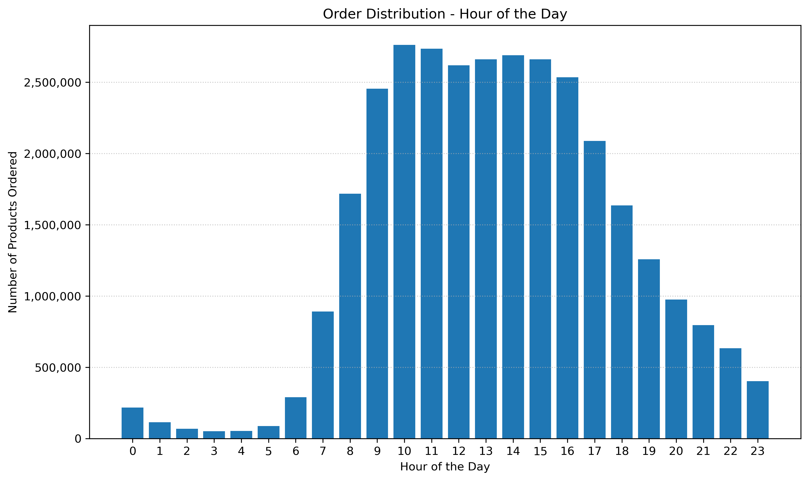

# Customer Segmentation & Behavioural Analysis
*This project was completed as part of the [CareerFoundry Data Analytics Programme](https://careerfoundry.com/en/courses/become-a-data-analyst/).*

## Overview
An online grocery store that engages with customers through a mobile app is looking to refine its marketing strategy using data-driven insights. This project uses Python to analyse demographic and transactional data, creating customer segments and spending profiles that inform targeted product placement and personalised marketing strategies.

## Tools
- **Python** (Jupyter | Anaconda) - Scripting
- **pandas | numpy | os** - Data Processing & Manipulation
- **matplotlib | seaborn** - Plotting | Visualisation
<!--- **Excel** - Reporting-->

## Process
- **Data Preparation** - Wrangling | Merging | Subsetting | Grouping | Aggregation | Deriving new Variables
- **Analysis** - Exploratory Analysis | Segmentation & Profiling | Descriptive Statistics | Trend Analysis
- **Communication** - Visualisation | Reporting

## Data
This analysis uses publicly available data originally sourced from **Instacart** via **Kaggle**. The links as well as an additional customers dataset was provided by **CareerFoundry** as part of their Data Analytics Course.

- [**Customers**](https://s3.amazonaws.com/coach-courses-us/public/courses/data-immersion/A4/A4_Data_Assets/customers.zip) - Customer ID, Name, Surname, Gender, State, Age, Date Joined, Dependants, Family Status, and Income
- [**Dataset**](https://www.kaggle.com/datasets/psparks/instacart-market-basket-analysis)

    - **Departments** - Department id and name
    - **OrdersProducts** - Order id, product id, add to cart order, and reorder indicator.
    - **Orders** - Order is, order number, order day of week, order hour of day, days since prior order.
    - **Products** - Product id, name, aisle, department, and price.

The Instacart Dataset was accessed on 7 September 2024.

<!--## Deliverables
- **Excel Report** -->

## Key Insights
### 1. Customer order activity follows a predictable rhythm shaped by consistent daily and weekly cycles.

A clear daily cycle emerges with low overnight activity, a morning surge, sustained midday volume, and a steady evening decline. This rhythm is consistent across the week, indicating routine-based purchasing behaviour.

Layered over the daily rhythm is a weekly cycle that amplifies this pattern over weekends. Saturday consistently records the highest order volumes, while Sunday starts strong only to level off earlier, forming a hybrid pattern of high morning demand and a less active afternoon.

This predictable behaviour provides opportunities to optimise staffing, inventory, and promotional efforts by aligning with the dual rhythm of daily and weekly order cycles.

<table>
    <tr>
        <td align="left" valign="top" width="50%">
             
            <em> <strong>Weekday Stability:</strong> Order volumes are relatively stable from Monday to Friday.</em>
            

            <em> <strong>Mid-Week Dip:</strong> A noticeable dip in activity occurs mid-week, with Wednesday registering the lowest order volume.</em>
            

            <em> <strong>Weekend Surge:</strong> A significant increase in order volume occurs over the weekend, which peaks on Saturday.</em>
        </td>
        <td align="left" valign="top" width="50%">
             
            <em><strong>Overnight Lull:</strong> Order activity is minimal during the early morning hours from midnight to 6 am.</em>
            

            <em><strong>Morning Ramp-Up:</strong> A sharp surge in orders begins at 6 am, with activity rapidly increasing until 9 am.</em>
            

            <em><strong>Sustained Daytime Peak:</strong> Order volumes remain at a sustained peak from 9 am until 4 pm.</em>
            

            <em><strong>Evening Decline:</strong> After 4 pm, orders begin a gradual and steady decline, eventually returning to the low levels seen in the early morning.</em>
        </td>
    </tr>
    <tr>
        <td align="left" valign="top" width="50%">
             
            <em><strong>Consistent Daily Pattern:</strong> The daily cycle is consistent throughout the week with the primary differentiator between days being the overall volume, not the timing of the activity.</em>
            

            <em><strong>Amplified Weekend Volume:</strong> Midday peaks are significantly more pronounced over the weekend, with Saturday reaching the highest volumes of the week. Sunday exhibits a similar but less consistent pattern that drops off sooner.</em>
        </td>
        <td align="left" valign="top" width="50%">
             
            <em><strong>Unique Sunday Pattern:</strong> Unlike the other days which show a relatively flat midday peak, Sunday's activity is less consistent. It features high volumes around 9 am, followed by a slight but noticeable drop to a lower, yet still elevated, plateau until approximately 4 pm.</em>
        </td>
    </tr>
</table>

### 2. How does average spending per product vary over time?

<table>
    <tr>
        <td align="center" valign="top" width="50%">
             
            <em>Annotation.</em>
        </td>
        <td align="center" valign="top" width="50%">
           
          <em>Annotation.</em>
        </td>
    </tr>
    <tr>
        <td align="center" valign="top" width="50%">
             
            <em>Annotation.</em>
        </td>
        <td align="center" valign="top" width="50%">
             
            <em>Annotation.</em>
        </td>
    </tr>
</table>

### 3. How can products be categorised into price ranges to support product placement?

### 4. Which products, within their respective departments and categories, are most popular?

### 5. How can ordering behaviour and demographic information be used to categorise customers?

### 6. How does ordering habits vary across customer profiles?

## Takeaways
### Successes
The project provided actionable insights into ordering behaviour across customer profiles, enabling a more targeted marketing strategy through better product placement.

### Challenges
While data wrangling was straightforward, producing clear visualisations in Python required significant customisation. Unlike Tableau’s interactive interface, Python tools like Matplotlib and Seaborn needed more effort to ensure readability and interpretability.

### Way Forward
Building a Tableau storyboard to present key findings in an interactive format could enhance storytelling and enable stakeholders to explore trends, segments, and behaviours through dynamic dashboards and filters.
