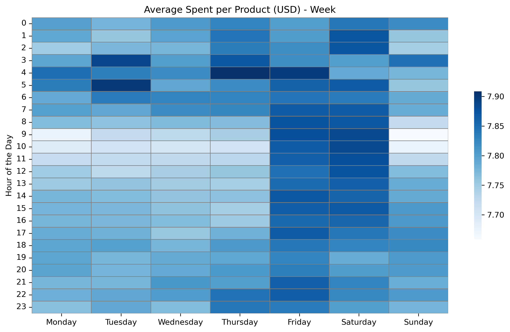

# Customer Segmentation & Behavioural Analysis
*This project was completed as part of the [CareerFoundry Data Analytics Programme](https://careerfoundry.com/en/courses/become-a-data-analyst/).*

## Overview
An online grocery store that engages with customers through a mobile app is looking to refine its marketing strategy using data-driven insights. This project uses Python to analyse demographic and transactional data, creating customer segments and spending profiles that inform targeted product placement and personalised marketing strategies.

## Tools
- **Python** (Jupyter | Anaconda) - Scripting
- **pandas | numpy | os** - Data Processing & Manipulation
- **matplotlib | seaborn** - Plotting | Visualisation
<!--- **Excel** - Reporting-->

## Process
- **Preparation** - Wrangling | Merging | Subsetting | Grouping | Aggregation | Deriving new Variables
- **Analysis** - Exploratory Analysis | Segmentation & Profiling | Descriptive Statistics | Trend Analysis
- **Communication** - Visualisation | Reporting

## Data
This analysis uses publicly available data originally sourced from **Instacart** via **Kaggle**. The links as well as an additional customers dataset was provided by **CareerFoundry** as part of their Data Analytics Course.

- [**Customers**](https://s3.amazonaws.com/coach-courses-us/public/courses/data-immersion/A4/A4_Data_Assets/customers.zip) - Customer ID, Name, Surname, Gender, State, Age, Date Joined, Dependants, Family Status, and Income
- [**Dataset**](https://www.kaggle.com/datasets/psparks/instacart-market-basket-analysis)

    - **Departments** - Department id and name
    - **OrdersProducts** - Order id, product id, add to cart order, and reorder indicator.
    - **Orders** - Order is, order number, order day of week, order hour of day, days since prior order.
    - **Products** - Product id, name, aisle, department, and price.

The Instacart Dataset was accessed on 7 September 2024.

<!--## Deliverables
- **Excel Report** -->

## Key Insights
### 1. Customer order activity follows a predictable rhythm shaped by consistent daily and weekly cycles.
A clear daily cycle emerges with low overnight activity, a morning surge, sustained midday volume, and a steady evening decline. This rhythm is consistent across the week, indicating routine-based purchasing behaviour.

Layered over the daily rhythm is a weekly cycle that amplifies this pattern over weekends. Saturday consistently records the highest order volumes, while Sunday starts strong only to level off earlier, forming a hybrid pattern of high morning demand and a less active afternoon.

This predictable behaviour provides opportunities to optimise staffing, inventory, and promotional efforts by aligning with the dual rhythm of daily and weekly order cycles.

<table>
    <tr>
        <td align="left" valign="top" width="50%">
             
            <em> <strong>Weekday Stability:</strong> Order volumes are relatively stable from Monday to Friday.</em>
            

            <em> <strong>Mid-Week Dip:</strong> A noticeable dip in activity occurs mid-week, with Wednesday registering the lowest order volume.</em>
            

            <em> <strong>Weekend Surge:</strong> A significant increase in order volume occurs over the weekend, which peaks on Saturday.</em>
        </td>
        <td align="left" valign="top" width="50%">
             
            <em><strong>Overnight Lull:</strong> Order activity is minimal during the early morning hours from midnight to 6 am.</em>
            

            <em><strong>Morning Ramp-Up:</strong> A sharp surge in orders begins at 6 am, with activity rapidly increasing until 9 am.</em>
            

            <em><strong>Sustained Daytime Peak:</strong> Order volumes remain at a sustained peak from 9 am until 4 pm.</em>
            

            <em><strong>Evening Decline:</strong> After 4 pm, orders begin a gradual and steady decline, eventually returning to the low levels seen in the early morning.</em>
        </td>
    </tr>
    <tr>
        <td align="left" valign="top" width="50%">
             
            <em><strong>Consistent Daily Pattern:</strong> The daily cycle of a morning ramp-up, midday peak, and evening decline is consistent throughout the week. The main difference between days lies in volume, not timing.
            

        </td>
        <td align="left" valign="top" width="50%">
             
            <em><strong>Sunday Midday Drop:</strong> While Sunday generally follows the same daily pattern, its peak is less stable — a strong surge between 9 and 11 am drops to a lower, though still elevated, level for the rest of the peak window.</em>
        </td>
    </tr>
</table>
 

### 2. How does average spending per product vary over time?
Analysing average spending per product over time reveals consistent patterns from Sunday to Thursday. Early morning spending is elevated, but shows sporadic behaviour, with occasional peaks between 3 a.m. and 6 a.m. This is followed by a sharp decline to the lowest spending levels between 9 a.m. and 12 p.m., after which it stabilises at a moderate level until midnight.

In contrast, spending on Fridays and Saturdays remains consistently high throughout the day, reaching the highest daily averages. This increase begins on Thursday at 10 p.m. and persists until Sunday, when spending returns to normal levels.

<table>
    <tr>
        <td align="center" valign="top" width="50%">
             
            <em>Annotation.</em>
        </td>
        <td align="center" valign="top" width="50%">
             
            <em>Annotation.</em>
        </td>
    </tr>
    <tr>
        <td align="center" valign="top" width="50%">
             
            <em>Annotation.</em>
        </td>
        <td align="center" valign="top" width="50%">
             
            <em>Annotation.</em>
        </td>
    </tr>
</table>
 

### 3. How can products be categorised into price ranges to support product placement?
A price distribution analysis revealed that most products are priced between $1 and $15, with a median inventory price of $7.10 and a median sales price of $7.40. While the majority fall within this range, a smaller portion of products are priced between $15 and $25.

To support optimised product placement that aligns with spending habits, premium products were first defined by their limited availability. The interquartile range (IQR) was then applied to classify the remaining products based on their price distribution as follows:

- Low Price ($1 to $4.2) - Products below Q1.
- Mid Price ($4.2 to $11.3) - Products between Q1 & Q3.
- High Price ($11.3 to $15) - Upper portion of readily available inventory
- Premium Price ($15 to $25) - Outliers ordered less frequently

<table>
    <tr>
        <td align="center" valign="top" width="50%">
             
            <em>Annotation.</em>
        </td>
        <td align="center" valign="top" width="50%">
             
            <em>Annotation.</em>
        </td>
    </tr>
    <tr>
        <td align="center" valign="top" width="50%">
             
            <em>Annotation.</em>
        </td>
        <td align="center" valign="top" width="50%">
             
            <em>Annotation.</em>
        </td>
    </tr>
</table>
 

### 4. Which products, within their respective departments and categories, are most popular?
To analyse product popularity, departments were grouped into simplified categories based on shelf life, with a separate category for miscellaneous items:

- Perishables – Includes departments such as produce, dairy, bakery, eggs, deli, meat, and seafood, all of which have a short shelf life.
- Non-Perishables – Covers snacks, frozen goods, bulk items, canned goods, dry goods, pasta, pantry staples, and breakfast items, which have an extended shelf life.
- Miscellaneous – Consists of departments such as international, missing, and other.

Analysis revealed that perishables are the most frequently ordered category, followed by non-perishables. In contrast, categories like alcoholic beverages, pet supplies, and miscellaneous items exhibit significantly lower order frequencies. Within perishables, produce leads in order

<table>
    <tr>
        <td align="center" valign="top" width="50%">
             
            <em>Annotation.</em>
        </td>
        <td align="center" valign="top" width="50%">
             
            <em>Annotation.</em>
        </td>
    </tr>
</table>
 

### 5. How can ordering behaviour and demographic information be used to categorise customers?

#### Demographic Information
Customers were further categorised by region, income, age, and family status. Family status was derived from marital status and the number of dependents, allowing segmentation based on household composition.

Analysis revealed that most customers are adults or middle aged and have a families. The majority of customers earned within the middle income range and were primarily located in the South.

<table>
    <tr>
        <td align="center" valign="top" width="50%">
             
            <em>Annotation.</em>
        </td>
        <td align="center" valign="top" width="50%">
             
            <em>Annotation.</em>
        </td>
    </tr>
    <tr>
        <td align="center" valign="top" width="50%">
             
            <em>Annotation.</em>
        </td>
        <td align="center" valign="top" width="50%">
             
            <em>Annotation.</em>
        </td>
    </tr>
</table>
 

#### Order Behaviour
Initial categorisation of customers was based on order behaviour, using the interquartile range (IQR) to create the following variables with three categories each:

- Activity – Total number of orders placed.
- Spending – Average amount spent per product.
- Frequency – Median number of days between orders.

Each variable was assigned a score from 1 to 3, based on the category. These scores were then summed to calculate a loyalty score, which was further segmented using the IQR method to define loyalty categories:

- Low Loyalty - Combined score of 5 or less
- Moderate Loyalty - Combined score above 5 but ≤  7
- High Loyalty - Combine score above 7

Bar chart analysis showed that most customers fall into the low activity and rare shopper categories, with moderate spending. Consequently, low loyalty customers represent the largest segment.

<table>
    <tr>
        <td align="center" valign="top" width="50%">
             
        </td>
        <td align="center" valign="top" width="50%">
            <em>Annotation.</em>
        </td>
    </tr>
</table>
 

### 6. How does ordering habits vary across customer profiles?
#### Customer Loyalty
Examining the ordering habits of customer loyalty groups revealed that while low loyalty customers make up the largest portion of the customer base and high loyalty customers the smallest, moderate loyalty customers place the highest total number of orders. Additionally, high loyalty customers place more orders relative to their population size, whereas low loyalty customers place fewer orders in comparison.

Further analysis showed that moderate and low loyalty customers generally follow overall ordering trends, whereas high loyalty customers deviate from the norm, showing less pronounced peaks in order volume and average spending during peak periods. Notably, high loyalty customers spend the most per item on average, while low loyalty customers spend the least.

Deviations were also observed in product preferences. Most notably, high loyalty customers' demonstrated a lower interest in snacks than anticipated, while low loyalty customers’ preference for snacks exceeding expectations.

<table>
    <tr>
        <td align="center" valign="top" width="33%">
             
            <em>Annotation.</em>
        </td>
        <td align="center" valign="top" width="33%">
             
            <em>Annotation.</em>
        </td>
        <td align="center" valign="top" width="33%">
             
            <em>Annotation.</em>
        </td>
    </tr>
    <tr>
        <td align="center" valign="top" width="33%">
             
            <em>Annotation.</em>
        </td>
        <td align="center" valign="top" width="33%">
             
            <em>Annotation.</em>
        </td>
        <td align="center" valign="top" width="33%">
             
            <em>Annotation.</em>
        </td>
    </tr>
</table>
 

#### Region
Examining ordering habits across regions revealed that the total number of orders align with the distribution of customers. Further analysis showed that regions generally follow overall ordering trends. However, some deviation was observed in average spending, with the Northeast generally spending less than other regions, showing a notable decline on Tuesdays and at 1 a.m. in the morning.

<table>
    <tr>
        <td align="center" valign="top" width="33%">
             
            <em>Annotation.</em>
        </td>
        <td align="center" valign="top" width="33%">
             
            <em>Annotation.</em>
        </td>
        <td align="center" valign="top" width="33%">
             
            <em>Annotation.</em>
        </td>
    </tr>
    <tr>
        <td align="center" valign="top" width="33%">
             
            <em>Annotation.</em>
        </td>
        <td align="center" valign="top" width="33%">
             
            <em>Annotation.</em>
        </td>
        <td align="center" valign="top" width="33%">
             
            <em>Annotation.</em>
        </td>
    </tr>
</table>
 

#### Age
Examining ordering habits across age groups revealed that the total number of orders align with the distribution of customers. Further analysis revealed that age groups generally follow overall ordering trends. However, some deviation was observed in average spending, with young adults and middle aged customers displaying a notable rise in spending on Tuesdays, while seniors' spending peaking on Fridays, compared to other groups who typically peak on Saturdays. Young adults also tend to spend significantly less than other age groups at 10 a.m. when overall spending is at its lowest.

<table>
    <tr>
        <td align="center" valign="top" width="33%">
             
            <em>Annotation.</em>
        </td>
        <td align="center" valign="top" width="33%">
             
            <em>Annotation.</em>
        </td>
        <td align="center" valign="top" width="33%">
             
            <em>Annotation.</em>
        </td>
    </tr>
    <tr>
        <td align="center" valign="top" width="33%">
             
            <em>Annotation.</em>
        </td>
        <td align="center" valign="top" width="33%">
             
            <em>Annotation.</em>
        </td>
        <td align="center" valign="top" width="33%">
             
            <em>Annotation.</em>
        </td>
    </tr>
</table>
 

#### Income
Examining ordering habits across income groups revealed that while middle income customers constitute the largest portion of the customer base and place the most orders, high income customers place more orders relative to their population size, whereas low income customers place fewer orders in comparison.

Further analysis showed that middle and high income customers generally follow overall ordering trends, whereas low income customers deviate from the norm, showing later weekly, and earlier daily peaks in order volume. Notably, average spending is closely aligned between middle and high income groups, with only minor variations in hourly spending, while the low income group spends significantly less at all times.

Deviations were also observed in terms of product preferences, with low income customers favouring non-perishables more in proportion to their customer base, particularly snacks and beverages.

<table>
    <tr>
        <td align="center" valign="top" width="33%">
             
            <em>Annotation.</em>
        </td>
        <td align="center" valign="top" width="33%">
             
            <em>Annotation.</em>
        </td>
        <td align="center" valign="top" width="33%">
             
            <em>Annotation.</em>
        </td>
    </tr>
    <tr>
        <td align="center" valign="top" width="33%">
             
            <em>Annotation.</em>
        </td>
        <td align="center" valign="top" width="33%">
             
            <em>Annotation.</em>
        </td>
        <td align="center" valign="top" width="33%">
             
            <em>Annotation.</em>
        </td>
    </tr>
</table>
 

#### Family Status
Examining ordering habits across customer family groups revealed that the total number of orders aligns with the distribution of customers. Further analysis showed that family groups generally follow overall trends. However, some deviation was observed in average spending with young parents displaying a notable rise in spending on Tuesdays and Wednesdays, while hourly spending exhibit another notable peak at 5 a.m. Spending on Saturdays also showed a distinct difference between age groups.

<table>
    <tr>
        <td align="center" valign="top" width="33%">
             
            <em>Annotation.</em>
        </td>
        <td align="center" valign="top" width="33%">
             
          <em>Annotation.</em>
        </td>
        <td align="center" valign="top" width="33%">
             
            <em>Annotation.</em>
        </td>
    </tr>
    <tr>
        <td align="center" valign="top" width="33%">
             
          <em>Annotation.</em>
        </td>
        <td align="center" valign="top" width="33%">
             
            <em>Annotation.</em>
        </td>
        <td align="center" valign="top" width="33%">
             
          <em>Annotation.</em>
        </td>
    </tr>
</table>
 

<!-- ## Recommendations
To optimise engagement and maximise revenue, advertisements should be scheduled during periods of reduced order activity, specifically after 4 p.m. in the evenings and before 7 a.m. in the early morning.

Mid-priced products should be promoted in the evenings, when spending remains moderate. Higher-priced products are better suited for late Thursday and Friday evenings, as well as early mornings, when spending is elevated. Premium products should be targeted between 3 a.m. and 6 a.m., when spending reaches its highest levels.

Food and beverage products should be the primary focus of promotions, with fresh produce, dairy, and eggs leading demand.

Moderate loyalty customers, who place the most orders, should be targeted with a mix of staple and premium products. High loyalty customers, with their stable spending habits and preference for healthier products, are ideal targets for premium and high-quality fresh food promotions. Low loyalty customers, who are more price sensitive, should be targeted with budget friendly non-perishables and beverages.

Income based targeting should be considered, with high income customers engaging more with premium and high priced products, while low-income customers respond better to lower cost essential goods.-->

## Takeaways
### Successes
The project provided actionable insights into ordering behaviour across customer profiles, enabling a more targeted marketing strategy through better product placement.

### Challenges
While data wrangling was straightforward, producing clear visualisations in Python required significant customisation. Unlike Tableau’s interactive interface, Python tools like Matplotlib and Seaborn needed more effort to ensure readability and interpretability.

### Way Forward
Building a Tableau storyboard to present key findings in an interactive format could enhance storytelling and enable stakeholders to explore trends, segments, and behaviours through dynamic dashboards and filters.
